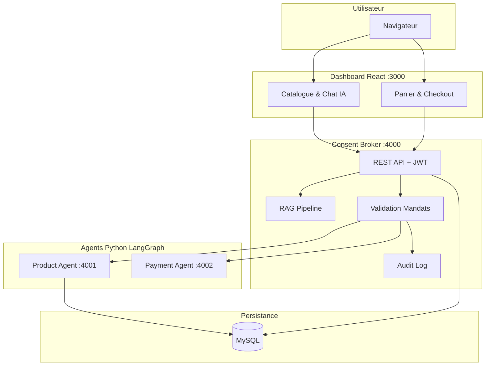
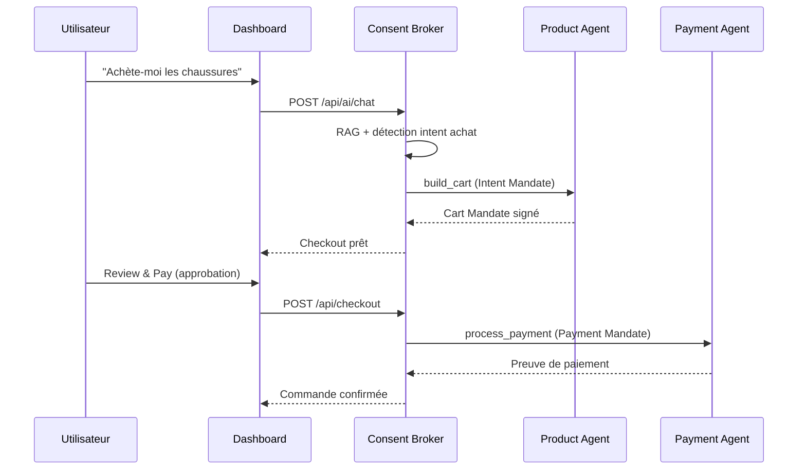

<div align="center">

# Pixelium Consent Commerce

**Commerce agentique avec consentement humain — Pixelium 2026**

[](https://pixelium.duckdns.org)
[](https://github.com/Aladimassi/Pixeliumstg)
[](./docs/ARCHITECTURE_ENCADRANT.pdf)

*Des agents IA qui achètent pour vous — seulement quand vous le décidez.*

[Essayer la démo](https://pixelium.duckdns.org) · [Documentation](#-documentation) · [Démarrage rapide](#-démarrage-rapide)

</div>

---

## En bref

**Pixelium Consent Commerce** est une boutique en ligne intelligente où des **agents IA autonomes** (LangGraph) recherchent des produits, construisent un panier et préparent un paiement — **uniquement après validation explicite** de l'utilisateur.

Chaque achat suit une **chaîne de mandats signés** inspirée du protocole **AP2** (Agent Payments Protocol) :

```
Intent Mandate  →  Cart Mandate  →  Payment Mandate  →  Paiement simulé
   (intention)       (panier)          (consentement)
```

Un **Consent Broker** central valide, signe et journalise chaque étape. Les agents ne parlent jamais directement au navigateur : le broker est le seul point de contrôle.

| | |
|:--|:--|
| **Démo en production** | [https://pixelium.duckdns.org](https://pixelium.duckdns.org) |
| **Dépôt** | [github.com/Aladimassi/Pixeliumstg](https://github.com/Aladimassi/Pixeliumstg) |

---

## Documentation

| Document | Description |
|----------|-------------|
| [Architecture (PDF)](./docs/ARCHITECTURE_ENCADRANT.pdf) | Vue d'ensemble complète du système |
| [Architecture (HTML)](./docs/ARCHITECTURE_ENCADRANT.html) | Même contenu, format web |
| [Format des mandats](./docs/MANDATE_FORMAT.md) | Spécification Intent / Cart / Payment |
| [Déploiement](./docs/DEPLOY.md) | Docker, HTTPS, VPS / Azure |
| [Sécurité](./docs/SECURITY_FINDINGS.md) | Tests adversariaux et findings |
| [Script de démo](./docs/DEMO_SCRIPT.md) | Scénario pas-à-pas |

---

## Ce qui rend ce projet unique

<table>
<tr>
<td width="50%" valign="top">

### Consentement à chaque étape

Pas de paiement « fantôme ». L'utilisateur voit le panier, revoit le montant, et clique **Review & Pay** avant tout débit simulé.

### Agents isolés (A2A)

Deux agents Python (produit + paiement) communiquent via le broker en style **Agent-to-Agent**. Le frontend ne les appelle jamais directement.

</td>
<td width="50%" valign="top">

### Assistant conversationnel (RAG)

Embeddings + vector store + reranking + Groq LLM. L'IA comprend le contexte multi-tours et distingue **conseil** vs **intention d'achat**.

### Production-ready

Déployé sur **Azure VM** avec Docker Compose, nginx HTTPS, MySQL, et variables d'environnement sécurisées.

</td>
</tr>
</table>

---

## Fonctionnalités

| Fonctionnalité | Détail |
|----------------|--------|
| **Chat shopping multi-tours** | Historique de conversation ; l'IA se souvient du contexte |
| **Auto-checkout intelligent** | « Achète-moi les chaussures » → ouvre le modal de paiement |
| **Recommandations sans achat** | « Que me recommandes-tu ? » → suggestions uniquement |
| **Chaîne de mandats HMAC** | Intent → Cart → Payment, signés et validés par le broker |
| **Guardrails IA** | Filtrage entrée/sortie sur les requêtes et actions sensibles |
| **Auth JWT + MySQL** | Inscription, connexion, sessions sécurisées |
| **Isolation par utilisateur** | Panier, carte bancaire et commandes propres à chaque compte |
| **Audit complet** | Journal de toutes les opérations broker et mandats |
| **Voix (optionnel)** | Transcription audio via Groq Whisper |
| **Catalogue riche** | Produits avec descriptions, images et recherche sémantique |

---

## Architecture



### Flux d'un achat (realtime)



### Stack technique

| Couche | Technologies |
|--------|--------------|
| **Frontend** | React 19, Vite, TypeScript, CSS custom |
| **API & orchestration** | Node.js, Express, TypeScript |
| **Agents** | Python 3, LangGraph, FastAPI |
| **Intelligence** | Groq LLM, MiniLM embeddings, vector store, RAG |
| **Sécurité** | JWT, HMAC mandate signing, guardrails |
| **Données** | MySQL (auth, catalogue, audit) |
| **Infra** | Docker Compose, nginx, Azure VM, Let's Encrypt |

---

## Structure du monorepo

```
pixelium-consent-commerce/
├── apps/
│   ├── dashboard/          # Boutique React — catalogue, chat IA, checkout
│   └── broker/             # API REST, RAG, orchestration, guardrails
├── packages/
│   ├── shared/             # Mandats, signatures HMAC, types, catalogue
│   ├── auth/               # Utilisateurs MySQL + JWT
│   ├── catalog/            # Store produits MySQL
│   └── audit/              # Journal des commandes
├── services/
│   └── agents/             # Agents LangGraph Python (:4001, :4002)
├── docker/                 # Dockerfiles + nginx.conf
├── scripts/                # Déploiement Azure / VPS
└── docs/                   # Rapports, specs, architecture
```

| Service | Port | Rôle |
|---------|------|------|
| `apps/dashboard` | 3000 | Interface boutique (shop, cart, AI, profil) |
| `apps/broker` | 4000 | Orchestrateur central — seul « boss » |
| Product Agent | 4001 | Recherche catalogue + Cart Mandate |
| Payment Agent | 4002 | Validation mandats + charge simulée |
| MySQL | 3306 | Utilisateurs, produits, audit |

---

## Démarrage rapide

### Prérequis

- Node.js 20+
- Python 3.11+
- MySQL (local ou Docker)
- Clé API [Groq](https://console.groq.com/) (gratuite)

### Installation locale

```bash
git clone https://github.com/Aladimassi/Pixeliumstg.git
cd Pixeliumstg
npm install
pip install -r services/agents/requirements.txt
cp .env.example .env          # renseigner GROQ_API_KEY + MySQL
npm run build
npm run dev
```

Ouvrir **http://localhost:3000** — se connecter, parcourir le catalogue, discuter avec l'assistant IA, ou passer commande depuis le panier.

### Déploiement production (Docker)

```bash
cp .env.production.example .env   # mots de passe + GROQ_API_KEY
docker compose up -d --build
```

Guide complet : [docs/DEPLOY.md](./docs/DEPLOY.md) · Azure Windows : [docs/DEPLOY-AZURE-WINDOWS.md](./docs/DEPLOY-AZURE-WINDOWS.md)

```powershell
npm run deploy   # helper Windows
```

---

## Commandes utiles

```bash
npm run dev                  # Dev local (dashboard + broker + agents)
npm run demo:realtime        # Flux achat avec utilisateur présent
npm run demo:delegated       # Flux pré-autorisé (delegated)
npm run demo:ai              # Achat en langage naturel via Groq
npm run test:adversarial     # Tests de sécurité (mandats, injection)
npm run test:agents          # Tests unitaires Python (21 tests)
npm run verify               # Build + demos + tests complets
npm run complete             # Pipeline 8 semaines (install → verify)
```

---

## Roadmap

| Semaine | Focus | Statut |
|---------|-------|--------|
| 1 | Format mandats, repo, catalogue mock | ✅ |
| 2–3 | Agents A2A, handoff tâches | ✅ |
| 4 | Consent broker, flux realtime | ✅ |
| 5 | Flux delegated + monitor | ✅ |
| 6 | Dashboard audit | ✅ |
| 7 | Tests adversariaux | ✅ |
| 8 | Rapport, usabilité, polish démo | ✅ |

---

## Protocoles de référence

- [A2A Protocol](https://a2a-protocol.org/) — communication agent-to-agent
- [AP2](https://ap2-protocol.org/) — Agent Payments Protocol (Google)

---

<div align="center">

**Pixelium Internship Program 2026**

*Prototype de recherche — paiements simulés, ne pas utiliser en production.*

[⬆ Retour en haut](#pixelium-consent-commerce)

</div>
