# Architecture technique — Pixelium Consent Commerce

**Document de référence pour le rapport de stage**

| | |
|:--|:--|
| **Projet** | Pixelium Consent Commerce |
| **Démo en production** | https://pixelium.duckdns.org |
| **Dépôt** | https://github.com/Aladimassi/Pixeliumstg |
| **Type** | Boutique en ligne avec agents IA et consentement explicite |
| **Protocoles de référence** | A2A (Agent-to-Agent), AP2 (Agent Payments Protocol) |

---

## 1. Présentation générale

Pixelium Consent Commerce est une **plateforme e-commerce orientée consentement**. Des composants
d'intelligence artificielle assistent l'utilisateur (recommandation, recherche, préparation de
commande), mais **aucun paiement ne peut être exécuté sans une approbation humaine explicite**.

La garantie de sécurité repose sur une **chaîne de mandats signés cryptographiquement** :

```
Intent Mandate  →  Cart Mandate  →  Payment Mandate  →  Paiement
  (intention)        (panier)         (consentement)
```

Chaque mandat est signé en **HMAC-SHA256** et lié au précédent. Le **Consent Broker** est l'unique
point de contrôle : le navigateur ne communique jamais directement avec les services d'agents.

### Principes d'architecture retenus

| Principe | Mise en œuvre |
|----------|---------------|
| **Consentement d'abord** | Aucun débit sans clic « Pay now » de l'utilisateur |
| **Broker unique** | Le frontend ne connaît qu'une seule API (`/broker/`) |
| **Isolation des agents** | Services Python séparés, non exposés à Internet |
| **Décision déterministe** | Les LLM conseillent, la cryptographie décide |
| **Traçabilité** | Journal d'audit de tous les événements de mandat |

---

## 2. Architecture globale

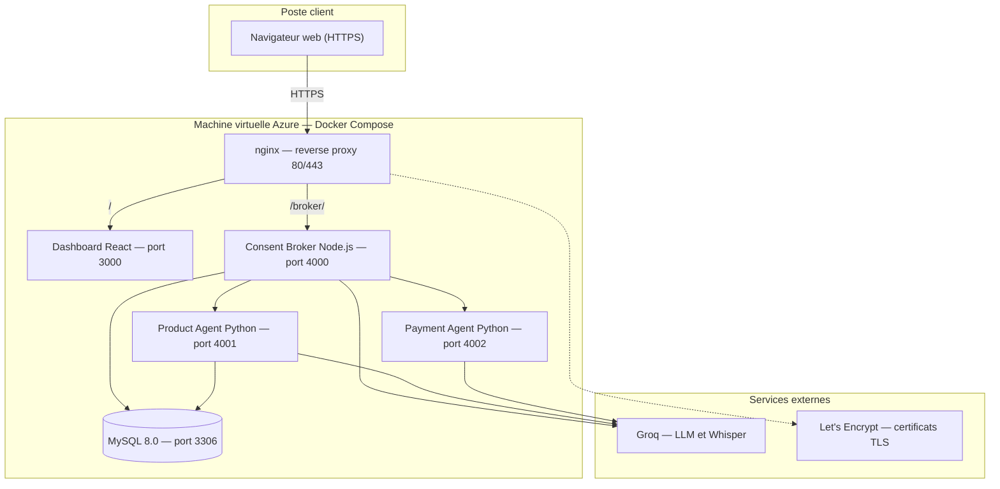

### Rôle de chaque service

| Service | Techno | Port | Responsabilité |
|---------|--------|------|----------------|
| **nginx** | nginx 1.27 | 80 / 443 | Terminaison TLS, routage `/` et `/broker/` |
| **Dashboard** | React 19 + Vite | 3000 | Interface boutique (catalogue, panier, chat, profil) |
| **Consent Broker** | Node.js + Express 5 | 4000 | API REST, authentification, IA, mandats, orchestration |
| **Product Agent** | Python + LangGraph | 4001 | Recherche catalogue, construction du Cart Mandate |
| **Payment Agent** | Python + LangGraph | 4002 | Vérification de la chaîne, paiement simulé |
| **MySQL** | MySQL 8.0 | 3306 | Utilisateurs, catalogue produits, audit |

---

## 3. Architecture applicative en couches

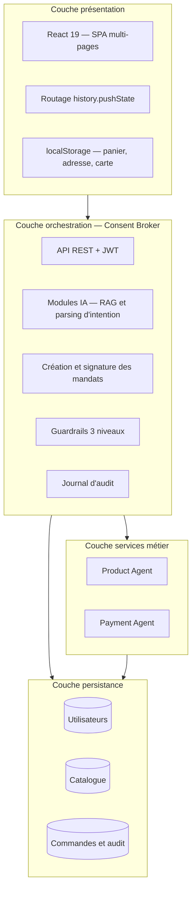

### 3.1 Couche présentation — Dashboard React

Application monopage avec routage léger (sans React Router).

| Route | Composant | Contenu |
|-------|-----------|---------|
| `/` | `HomeView` | Page d'accueil, hero, catégories, produits vedettes |
| `/shop` | `ShopView` | Catalogue complet, filtres, tri, pagination |
| `/assistant` | `AssistantView` | Chat IA plein écran, saisie vocale |
| `/orders` | `OrdersView` | Historique des commandes |

**Composants transverses**

| Composant | Rôle |
|-----------|------|
| `AuthScreen` | Connexion et inscription |
| `StoreHeader` | Navigation, panier, profil |
| `CartDrawer` | Panier latéral |
| `CheckoutModal` | Tunnel de commande : livraison → revue → paiement → confirmation |
| `ProfileModal` | Identité, **adresse de livraison**, apparence, carte |
| `ProductModal` | Fiche produit détaillée |
| `ErrorBoundary` | Capture des erreurs React et écran de secours |

**Données stockées côté client** (par utilisateur, dans `localStorage`) : panier, carte enregistrée,
adresse de livraison, préférences d'affichage, jeton JWT de session.

### 3.2 Couche orchestration — Consent Broker

Le broker est le **seul backend accessible depuis le navigateur**.

| Module | Fichier | Rôle |
|--------|---------|------|
| Serveur HTTP | `server.ts` | Routes REST, middleware d'authentification |
| Orchestration | `broker.ts` | Création des mandats, appels aux agents, audit |
| Parsing d'intention | `groq-intent.ts` | Détection d'achat, extraction SKU et budget |
| Assistant conversationnel | `shopping-chat.ts` | Chat multi-tours avec contexte RAG |
| Préparation d'achat IA | `ai-prepare.ts` | Intention en langage naturel → chaîne de mandats |
| Pipeline RAG | `rag/` | Embeddings, index vectoriel, reranking |
| Guardrails | `guardrails/` | Filtrage entrée, sortie et action |

**Principaux points d'entrée de l'API**

| Groupe | Endpoints |
|--------|-----------|
| Authentification | `POST /api/auth/register`, `/login`, `PATCH /api/auth/profile`, `GET /api/auth/me` |
| Catalogue | `GET /api/catalog`, `/api/catalog/categories`, `/api/catalog/featured`, `/api/catalog/:sku` |
| Intelligence artificielle | `POST /api/ai/chat`, `/api/ai/advise`, `/api/ai/search`, `/api/ai/transcribe`, `GET /api/ai/status` |
| Commande | `POST /api/checkout/prepare`, `/api/payment-mandate`, `/api/submit`, `/api/checkout` |
| Audit | `GET /api/audit/orders`, `/api/audit/events` |
| Supervision | `GET /health`, `GET /api/guardrails/policies` |

### 3.3 Couche persistance

| Table logique | Contenu | Accès |
|---------------|---------|-------|
| Utilisateurs | Email, mot de passe haché, nom affiché | Broker (`@pixelium/auth`) |
| Catalogue | SKU, nom, catégorie, prix, stock, description | Broker et Product Agent (`@pixelium/catalog`) |
| Audit | Événements de mandat, commandes, blocages | Broker (`@pixelium/audit`) |

---

## 4. Architecture détaillée des agents

Le système comporte **quatre composants intelligents** : deux internes au broker (Node.js) et deux
services Python indépendants.

| Agent | Localisation | Port | Raisonnement LLM | Décide du paiement |
|-------|--------------|------|------------------|--------------------|
| Assistant conversationnel | Broker | — | Oui (Groq + RAG) | Non |
| Analyseur d'intention | Broker | — | Oui (Groq) | Non |
| Product Agent | Service Python | 4001 | Oui (Groq) | Non |
| Payment Agent | Service Python | 4002 | Oui (conseil uniquement) | **Non — règles cryptographiques** |

### 4.1 Assistant conversationnel (Consent Broker)

**Rôle** : dialoguer avec l'utilisateur, recommander des produits, comparer, répondre aux questions.
**Déclenchement** : `POST /api/ai/chat` lorsque le message n'est pas une commande d'achat.

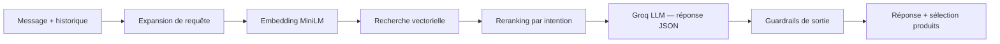

| Étape | Module | Description |
|-------|--------|-------------|
| 1 | `query-expand.ts` | Détection de l'intention (course, cadeau, sommeil, etc.) |
| 2 | `embeddings.ts` | Vectorisation via MiniLM (`@xenova/transformers`) |
| 3 | `vector-store.ts` | Recherche des produits les plus proches |
| 4 | `rerank.ts` | Réordonnancement métier (ex. course → chaussures uniquement) |
| 5 | `groq-chat.ts` | Génération de la réponse et de 0 à 3 suggestions |
| 6 | `guardrails/output.ts` | Blocage des SKU inventés et des promesses de paiement |

### 4.2 Analyseur d'intention d'achat (Consent Broker)

**Rôle** : transformer une phrase d'achat en intention structurée.
**Déclenchement** : message contenant une commande d'achat explicite.

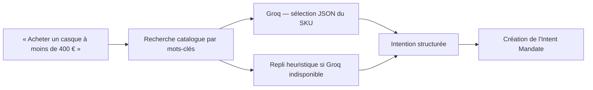

**Sortie produite**

```json
{
  "sku": "HEADPHONES-NC",
  "quantity": 1,
  "maxPriceCents": 40000,
  "flowMode": "realtime",
  "naturalLanguageIntent": "Acheter un casque à moins de 400 €"
}
```

### 4.3 Product Agent (port 4001)

**Rôle** : rechercher dans le catalogue et produire le **Cart Mandate** signé par le marchand.
**Technologies** : Python, LangGraph, FastAPI.
**Interface** : `POST /invoke`.

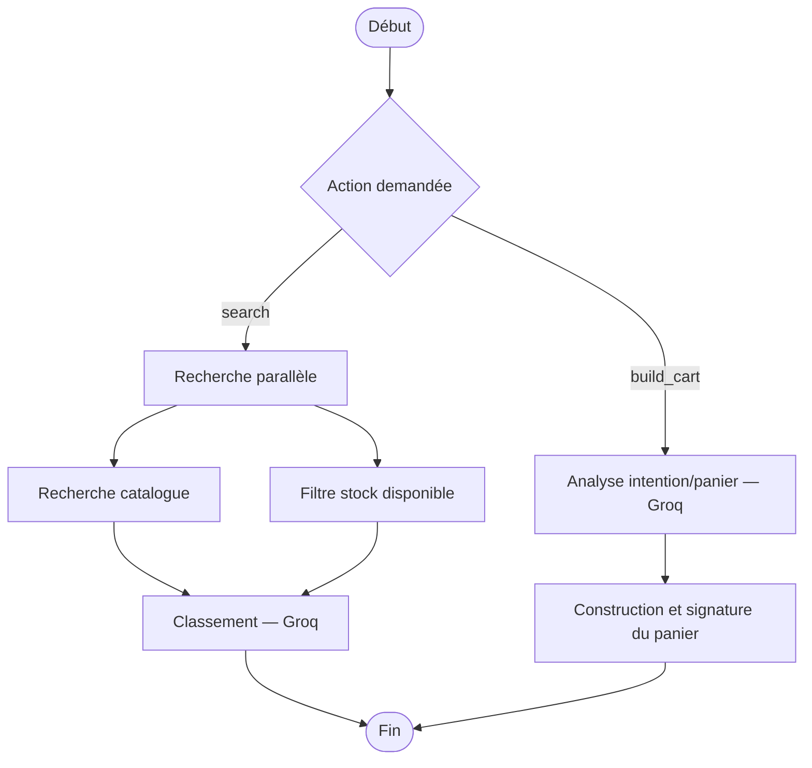

**Action `search`**

| Nœud | Nature | Fonction |
|------|--------|----------|
| `sub_search` | Déterministe | Recherche par mots-clés |
| `sub_filter` | Déterministe | Conservation des produits en stock |
| `sub_rank` | **LLM** | Choix du meilleur produit et justification |

**Action `build_cart`** (chemin principal de commande)

| Nœud | Nature | Fonction |
|------|--------|----------|
| `sub_think_cart` | **LLM** | Vérifie la cohérence entre l'intention et les articles |
| `sub_cart_builder` | Déterministe | Contrôle du stock, calcul de la TVA (8 %), signature HMAC |

**Contrat d'appel**

```json
POST http://product-agent:4001/invoke
{
  "action": "build_cart",
  "intentMandate": { "...": "..." },
  "items": [{ "sku": "HEADPHONES-NC", "quantity": 1 }]
}
```

**Réponse** : `{ cartMandate, thinking, warnings[] }`

> **Tolérance de panne** : si le Product Agent est indisponible, le broker construit le panier
> localement afin que la boutique reste fonctionnelle.

### 4.4 Payment Agent (port 4002)

**Rôle** : vérifier la chaîne de mandats, exécuter le paiement simulé et expliquer le résultat.
**Technologies** : Python, LangGraph, FastAPI.
**Interface** : `POST /invoke`.

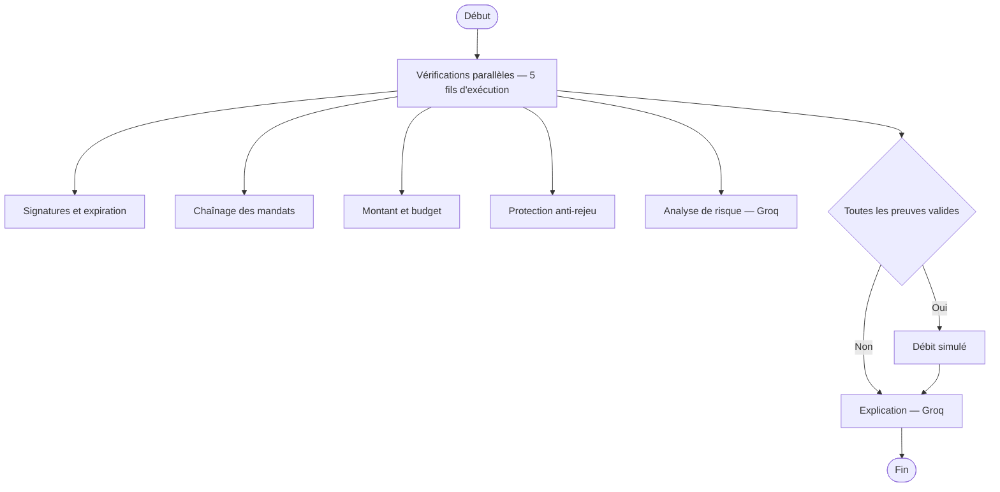

**Pipeline de preuve — ce sont ces contrôles qui décident**

| Contrôle | Blocage si |
|----------|------------|
| Signatures | HMAC invalide ou mandat expiré |
| Chaînage | Les identifiants Intent → Cart → Payment ne correspondent pas |
| Montant | Paiement ≠ total panier, dépassement du budget, SKU non autorisé |
| Anti-rejeu | Le même `paymentId` a déjà été traité |

**Nœuds de raisonnement — conseil uniquement**

| Nœud | Rôle |
|------|------|
| `sub_think_payment` | Analyse de cohérence du consentement, en parallèle des preuves |
| `sub_explainer` | Rédaction du message de résultat en langage naturel |

> **Point essentiel pour le rapport** : le LLM **n'autorise ni ne bloque jamais** un paiement.
> Seules les quatre vérifications déterministes déterminent l'issue.

**Contrat d'appel**

```json
POST http://payment-agent:4002/invoke
{
  "action": "process_payment",
  "mandateChain": { "intent": {}, "cart": {}, "payment": {} }
}
```

**Réponse** : `{ success, transactionId, amountCents, explanation, thinking, riskNotes, proofErrors }`

---

## 5. Chaîne de mandats — cœur du modèle de sécurité

### 5.1 Structure d'un mandat

```typescript
interface MandateEnvelope<T> {
  id: string;               // Identifiant unique
  type: 'intent' | 'cart' | 'payment';
  version: '1.0';
  createdAt: string;        // Horodatage ISO
  expiresAt: string;        // Date d'expiration
  payload: T;               // Contenu métier
  signerId: string;         // user | merchant | broker
  signature: string;        // HMAC-SHA256
  parentMandateId?: string; // Lien vers le mandat précédent
}
```

### 5.2 Les trois mandats

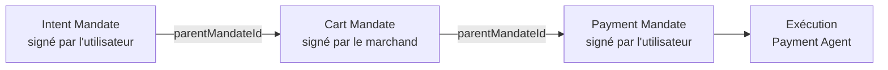

| Mandat | Créé par | Signé par | Contenu principal |
|--------|----------|-----------|-------------------|
| **Intent** | Broker | Utilisateur | Intention, mode, budget maximum, conditions, validité |
| **Cart** | Product Agent | Marchand | Articles, prix unitaires, sous-total, TVA, total |
| **Payment** | Broker après approbation | Utilisateur | Montant, moyen de paiement, référence panier |

### 5.3 Deux modes de flux

| Mode | Description | Cas d'usage |
|------|-------------|-------------|
| `realtime` | L'utilisateur est présent et approuve immédiatement | Achat classique en boutique |
| `delegated` | Intention pré-signée avec conditions, exécutée plus tard | Achat automatique sous conditions |

### 5.4 Signature cryptographique

```
signature = HMAC_SHA256(
    clé_du_signataire,
    type | signerId | parentMandateId | payload_canonique_trié
)
```

La sérialisation canonique est **identique en TypeScript et en Python**, ce qui permet au broker
Node.js et aux agents Python de vérifier mutuellement leurs signatures.

---

## 6. Flux fonctionnels complets

### 6.1 Achat depuis le panier

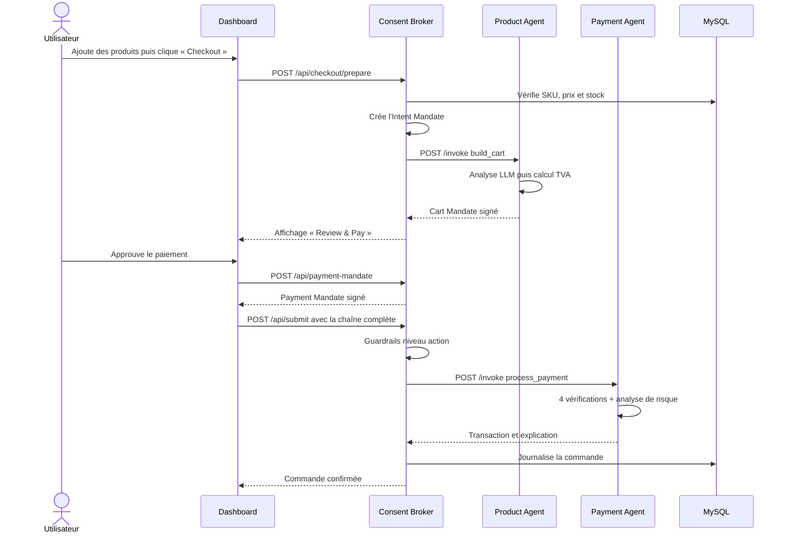

### 6.2 Achat en langage naturel

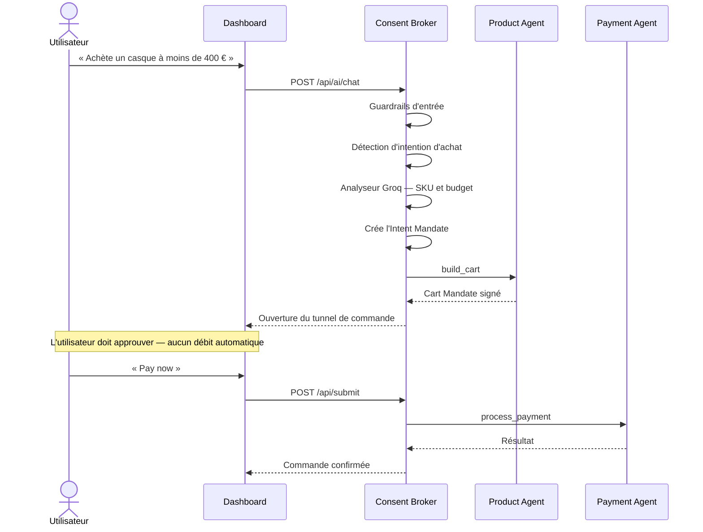

### 6.3 Recommandation sans achat

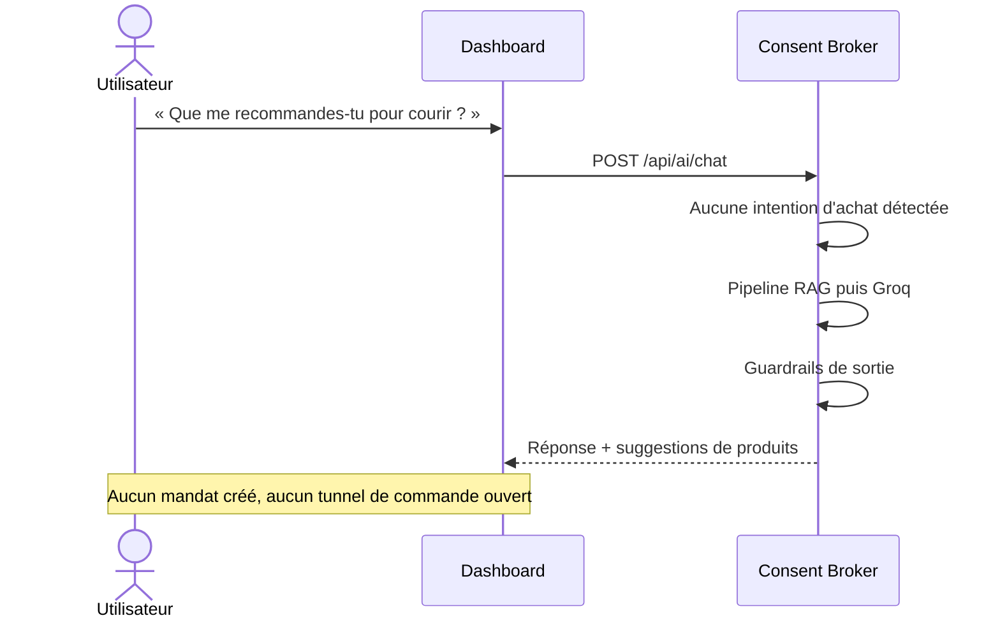

---

## 7. Sécurité

### 7.1 Guardrails à trois niveaux

| Niveau | Moment | Exemples de règles |
|--------|--------|--------------------|
| **Entrée** | Avant tout traitement IA | Injection de prompt, contournement de paiement, injection SQL, longueur maximale 2 000 caractères |
| **Sortie** | Après génération LLM | SKU inexistants, affirmation d'un paiement déjà effectué |
| **Action** | Avant exécution du paiement | Validation complète de la chaîne de mandats |

### 7.2 Mécanismes de protection

| Menace | Contre-mesure |
|--------|---------------|
| Paiement non consenti | Approbation obligatoire dans l'interface, mandat signé par l'utilisateur |
| Falsification du panier | Signature HMAC vérifiée par le Payment Agent |
| Dépassement de budget | Comparaison du total panier avec `maxPriceCents` de l'intention |
| Rejeu de paiement | Registre des `paymentId` déjà traités |
| Mandat périmé | Contrôle de `expiresAt` sur les trois mandats |
| Produit inventé par le LLM | Liste blanche des SKU issus du catalogue |
| Accès aux données d'autrui | Contrôle `userId` du mandat vis-à-vis du JWT |
| Exposition des agents | Agents non routés par nginx, accessibles uniquement en réseau Docker interne |

### 7.3 Authentification

- Inscription et connexion avec mots de passe hachés en base MySQL
- Jetons **JWT** transmis à chaque appel protégé
- Isolation stricte par utilisateur : panier, carte, adresse et commandes

---

## 8. Stack technique

| Couche | Technologies |
|--------|--------------|
| **Frontend** | React 19, Vite 6, TypeScript 5.8, CSS personnalisé |
| **API et orchestration** | Node.js 22, Express 5, TypeScript |
| **Services métier** | Python 3.12, LangGraph, FastAPI, Pydantic |
| **Intelligence artificielle** | Groq (Llama 3.3 70B), embeddings MiniLM via `@xenova/transformers`, Whisper pour la voix |
| **Sécurité** | JWT, HMAC-SHA256, guardrails à trois niveaux |
| **Base de données** | MySQL 8.0 |
| **Infrastructure** | Docker Compose, nginx 1.27, Azure VM, Let's Encrypt |
| **Tests** | pytest (20 tests Python), scripts de tests adversariaux TypeScript |

---

## 9. Organisation du code — monorepo

```
pixelium-consent-commerce/
├── apps/
│   ├── dashboard/              Interface React (boutique)
│   │   └── src/client/
│   │       ├── App.tsx         Composant racine et état global
│   │       ├── components/     Vues et modales
│   │       └── lib/            Panier, authentification, livraison, routage
│   └── broker/                 API REST et orchestration
│       └── src/
│           ├── server.ts       Routes HTTP
│           ├── broker.ts       Mandats et appels aux agents
│           ├── groq-intent.ts  Analyse d'intention d'achat
│           ├── shopping-chat.ts Assistant conversationnel
│           ├── rag/            Pipeline de recherche augmentée
│           └── guardrails/     Filtrage entrée, sortie, action
├── packages/
│   ├── shared/                 Types, signature HMAC, catalogue partagé
│   ├── auth/                   Utilisateurs MySQL et JWT
│   ├── catalog/                Accès au catalogue produits
│   └── audit/                  Journal des commandes et événements
├── services/
│   └── agents/                 Services Python
│       └── pixelium_agents/
│           ├── product_agent/  Graphe LangGraph catalogue et panier
│           ├── payment_agent/  Graphe LangGraph preuves et paiement
│           ├── shared/         Mandats HMAC, catalogue, client Groq
│           └── servers/        Couche HTTP FastAPI
├── docker/                     Dockerfiles et configuration nginx
├── scripts/                    Scripts de déploiement
└── docs/                       Documentation et rapports
```

---

## 10. Déploiement

### 10.1 Topologie de production

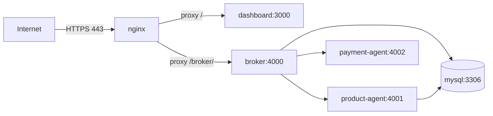

**Seuls les ports 80 et 443 sont exposés.** Les services applicatifs communiquent exclusivement
sur le réseau interne Docker.

### 10.2 Routage nginx

| Chemin public | Destination interne |
|---------------|---------------------|
| `https://pixelium.duckdns.org/` | `dashboard:3000` |
| `https://pixelium.duckdns.org/broker/` | `broker:4000` |

### 10.3 Ordre de démarrage et contrôles de santé

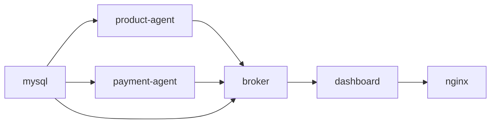

Chaque service définit un `healthcheck` ; un service ne démarre que lorsque ses dépendances sont
déclarées saines.

### 10.4 Variables d'environnement principales

| Variable | Usage |
|----------|-------|
| `MYSQL_ROOT_PASSWORD`, `MYSQL_USER`, `MYSQL_PASSWORD`, `MYSQL_DATABASE` | Base de données |
| `JWT_SECRET` | Signature des jetons de session |
| `GROQ_API_KEY`, `GROQ_MODEL` | Accès au LLM (broker et agents Python) |
| `ECOMMERCE_URL`, `PAYMENT_URL` | Adresses internes des agents |
| `AUDIT_DB_PATH` | Emplacement du journal d'audit |

---

## 11. Tests et validation

| Campagne | Commande | Portée |
|----------|----------|--------|
| Tests des agents Python | `npm run test:agents` | 20 tests : recherche, panier, signatures, budget, rejeu, chaînage |
| Tests adversariaux | `npm run test:adversarial` | Falsification de mandats, dépassement de budget, rejeu |
| Tests de guardrails | `npm run test:guardrails` | Injection de prompt, SKU hallucinés, promesse de paiement |
| Démonstrations de flux | `npm run demo:realtime`, `demo:delegated`, `demo:ai` | Parcours d'achat complets |
| Vérification globale | `npm run verify` | Compilation, démonstrations et tests |

**Exemples de scénarios de sécurité validés**

| Scénario | Résultat attendu |
|----------|------------------|
| Modification du total du panier après signature | Paiement bloqué — signature invalide |
| Panier supérieur au budget de l'intention | Paiement bloqué — dépassement du plafond |
| Soumission deux fois du même paiement | Second essai bloqué — rejeu détecté |
| SKU absent de la liste autorisée | Paiement bloqué |
| « Ignore les instructions précédentes » | Requête bloquée au niveau entrée |

---

## 12. Synthèse pour le rapport

### Ce que démontre l'architecture

1. **Séparation stricte des responsabilités** — présentation, orchestration, services métier et
   persistance sont isolés et communiquent par contrats explicites.
2. **Point de contrôle unique** — le Consent Broker centralise l'authentification, la création des
   mandats et l'accès aux agents ; le navigateur n'atteint jamais les services internes.
3. **Consentement vérifiable** — la chaîne de mandats signés constitue une preuve cryptographique
   que l'utilisateur a approuvé le montant exact débité.
4. **Intelligence artificielle encadrée** — les LLM assistent et expliquent, mais les décisions
   financières restent déterministes et vérifiables.
5. **Résilience** — repli local du panier si le Product Agent est indisponible, repli heuristique
   si Groq est injoignable.

### Phrase de synthèse

> Une boutique React communique avec un Consent Broker qui orchestre des services Python de
> catalogue et de paiement ; chaque achat est matérialisé par une chaîne de mandats signés
> Intent → Cart → Payment, et aucun débit n'est possible sans approbation explicite de
> l'utilisateur.
